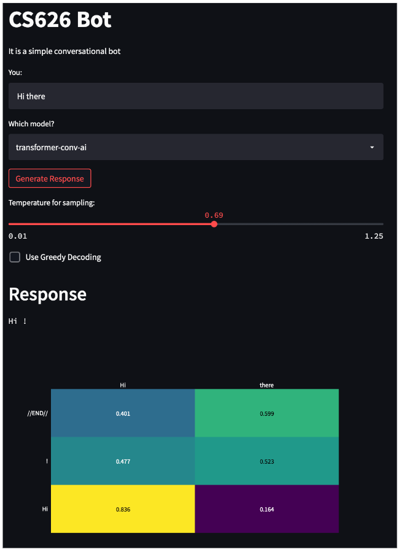

# Conversational-AI-Non-Task-Oriented-Casual-Conversation
This Repository Contains Codebase for the Project "Conversational AI: Non Task Oriented Casual Conversation".

In this project we created a non task-oriented neural conversational AI which is capable of response generation in a dialogue form. It is basically a transformer based chatbot. The model is trained on ConvAI2 which is a conversational data and can generate responses for casual queries.

We have also created a GUI/web interface for Human-Computer interaction where the user can give sentence and the model can generate a response in a dialogue form. 

